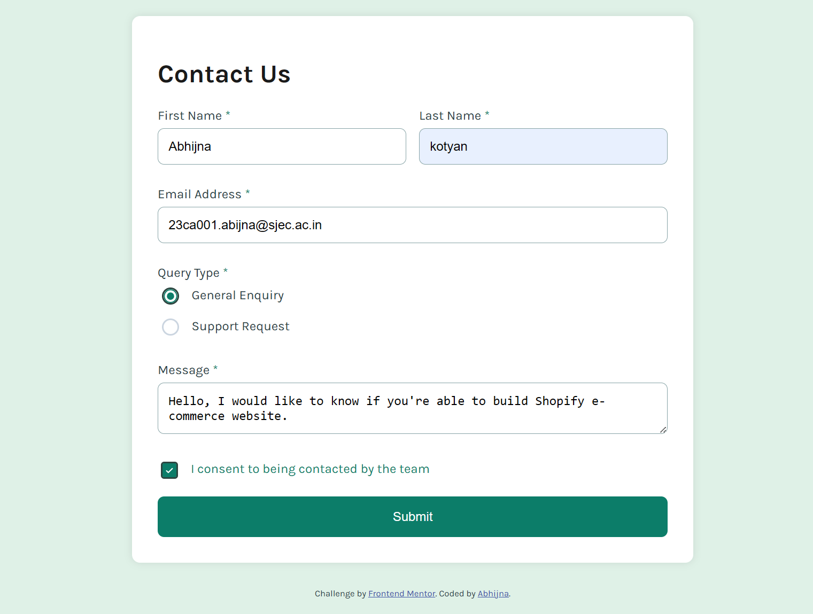

#👋🏻
# Frontend Mentor - Contact Form Solution
This is a solution to the [Contact form challenge on Frontend Mentor](https://www.frontendmentor.io/challenges/contact-form--G-hYlqKJj).

Frontend Mentor challenges help you improve your coding skills by building realistic projects. 

## Overview

### The challenge

Users should be able to:
- Complete the form and see a success toast message upon successful submission.
- Receive form validation messages if:
  - A required field has been missed.
  - The email address is not formatted correctly.
- Complete the form only using their keyboard.
- Have inputs, error messages, and the success message announced on their screen reader.
- View the optimal layout for the interface depending on their device's screen size.
- See hover and focus states for all interactive elements on the page.

### Screenshot

 
 
 
 
 

### Links
- Solution URL: [Solution on Frontend Mentor](https://www.frontendmentor.io/solutions/htmlcssjavascript-OtdVIzazYV)
- Live Site URL: [Live Site URL](https://contactform-frontendwebsite.netlify.app/)

## My process

### Built with
- Semantic HTML5 markup
- CSS custom properties (for theming)
- Flexbox for layout
- Mobile-first design approach
- [Vanilla JavaScript](https://developer.mozilla.org/en-US/docs/Web/JavaScript) for form validation and toast handling
- Basic accessibility principles, including ARIA roles

### What I learned
In this project, I learned:
- How to implement form validation using JavaScript.
- The importance of providing accessible user feedback through toast notifications.
- How to use CSS to create a responsive layout that adapts to different screen sizes.
- Improved my understanding of handling form submission events and user input.
  
### Useful resources

- [Example resource 1](https://www.example.com) - This helped me for XYZ reason. I really liked this pattern and will use it going forward.
- [Example resource 2](https://www.example.com) - This is an amazing article which helped me finally understand XYZ. I'd recommend it to anyone still learning this concept.

### Author
- Website - [Abhijna](https://contactform-frontendwebsite.netlify.app/)
- Frontend Mentor - [@Abhijnakotyan](https://www.frontendmentor.io/profile/Abhijnakotyan)